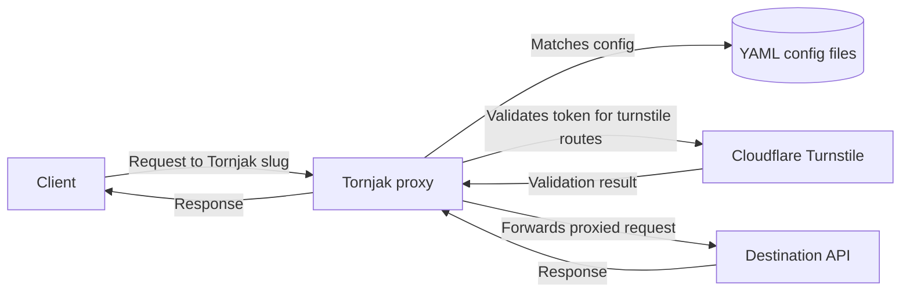

# tornjak

Tornjak is a Turnstile-aware proxy that loads YAML configs and forwards requests to the configured destination URLs.



## Run With Docker

Build the image:

```bash
docker build -t tornjak .
```

Run the container with your configs mounted into `/app/configs`:

```bash
docker run --rm \
  -p 3000:3000 \
  -v "$PWD/configs:/app/configs:z" \
  tornjak
```

After startup, the proxy listens on the configured port and logs a summary of the loaded configs. Tornjak watches the configs directory and automatically reloads the config set when a YAML file changes.

### Environment Variables

- `CONFIGS_DIR`: directory to watch and load YAML configs from. Defaults to `configs`.

- `PORT`: port to bind the HTTP server to. Defaults to `3000`

## Configuration

Create one or more YAML files in `configs/` with this shape:

```yaml
slug: app-proxy
destinationUrl: https://example.com
headers:
  authorization: bearer secret-token
turnstileSecret: secret-basic
defaultMode: bypass
batchingLimit: 5
routes:
  - methods:
      - GET
    paths:
      - /api/*
    mode: turnstile
  - methods:
      - POST
    paths:
      - /admin/*
    mode: block
```

### Fields

- `slug`: URL prefix used to match the proxy, for example `http://localhost:3000/app-proxy/...`
- `destinationUrl`: base URL that receives proxied requests
- `headers`: headers added to every proxied request. Defaults to `{}` when omitted
- `turnstileSecret`: required when any route uses `turnstile`. If no route uses `turnstile`, it can be omitted
- `defaultMode`: fallback mode when no route matches. Allowed values are `bypass`, `block`, and `turnstile`. Defaults to `bypass`
- `batchingLimit`: maximum number of requests allowed in a single batch call. Defaults to `5`. Set to `0` to disable batching entirely
- `routes`: list of path rules.
  - `methods`: optional HTTP method filters, one or more of `GET`, `POST`, `PUT`, `DELETE`, or `PATCH`. If omitted, the route applies to all methods
  - `paths`: optional glob patterns that match the request path. If omitted, the route matches any path
  - `mode`: behavior for matching requests, one of `bypass`, `block`, or `turnstile`
  - At least one of `methods` or `paths` must be provided

Tornjak reads every `*.yml` and `*.yaml` file in `configs/`, so you can split proxies across multiple files.

## Client Usage

Point your client at the proxy route instead of the upstream destination when you want Tornjak to mediate the request.

For the example config above, requests that would normally go to:

```text
https://example.com/api/users
```

should be sent through Tornjak as:

```text
http://localhost:3000/app-proxy/api/users
```

Use the `slug` as the path prefix, then append the upstream path after it. Tornjak will match the request against the configured route rules, apply any proxy headers, and forward it to the `destinationUrl`.

### Request Headers

| Header                  | Required               | Description                                                                                                                     |
| ----------------------- | ---------------------- | ------------------------------------------------------------------------------------------------------------------------------- |
| `cf-turnstile-response` | For `turnstile` routes | Turnstile response token to validate before proxying                                                                            |
| `cf-turnstile-cache-ms` | No                     | Cache successful validation for this duration in milliseconds. Token is keyed by token + client IP. Stripped before forwarding. |

### Batching

Tornjak supports batching multiple requests to the same slug in a single call. This is useful when you need to make several API calls atomically while sharing Turnstile validation.

Send a `POST` request to `/batch/{slug}` with a JSON body containing an array of request descriptors:

```json
POST http://localhost:3000/batch/app-proxy
Content-Type: application/json

[
  {
    "path": "/api/users",
    "method": "GET"
  },
  {
    "path": "/api/items",
    "method": "POST",
    "body": {"name": "new item"}
  }
]
```

Each descriptor object supports these fields:

| Field     | Required | Description                                      |
| --------- | -------- | ------------------------------------------------ |
| `path`    | Yes      | Upstream path. Auto-prefixed with `/` if omitted |
| `method`  | No       | HTTP method. Defaults to `GET`                   |
| `headers` | No       | Extra headers for this request only              |
| `body`    | No       | Request body string or JSON object               |

Batch request headers are forwarded to each sub-request. Body item headers override batch headers.

If one or more requests hit a `turnstile` route, Turnstile validation runs once and the result is shared across all matching requests in the batch.

Batches are limited to `batchingLimit` requests per call (default `5`). Requests that exceed this limit receive a `413` response. Set `batchingLimit: 0` to disable batching entirely.

The response is a JSON array where each element corresponds to the request at the same index:

```json
[
  {
    "status": 200,
    "statusText": "OK",
    "headers": { "content-type": "application/json" },
    "body": { "id": 1, "name": "alice" }
  },
  {
    "status": 201,
    "statusText": "Created",
    "headers": { "content-type": "application/json" },
    "body": { "id": 42, "name": "new item" }
  }
]
```

`body` is automatically parsed as JSON when the response `content-type` includes `application/json`. Otherwise it is returned as a raw string.

## Local Development

Required [Bun](https://bun.sh/) as a package manager and JS runtime.

1. Install dependencies:

```bash
bun install
```

2. Add at least one config file under `configs/`.

3. Start the app in watch mode:

```bash
bun run dev
```

Useful scripts from `package.json`:

- `bun run dev`: run the server with file watching
- `bun run lint`: fix lint issues with `oxlint`
- `bun run format`: format the project with `oxfmt`
- `bun run tscheck`: run TypeScript type checking without emitting files
- `bun test`: run the test suite

Also recommenced: install the `oxlint` and `oxfmt` [extensions in your editor](https://oxc.rs/docs/guide/usage/linter/editors.html)
